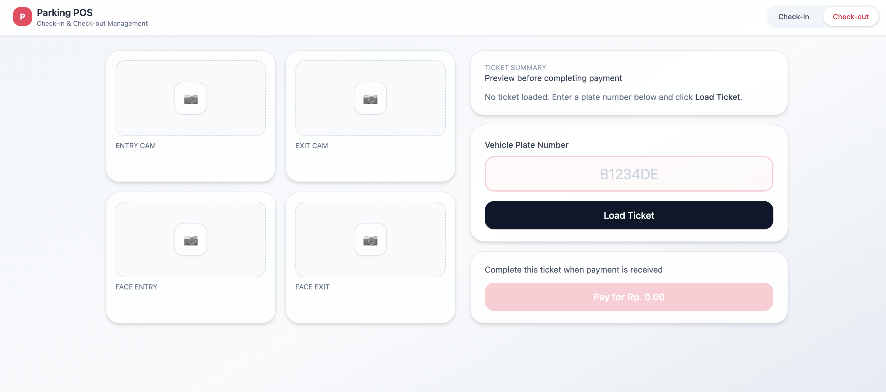

# Parking POS – Technical Assessment

A parking Point-of-Sale system built with **Spring Boot**, **PostgreSQL**, **React + Vite**, and **Docker Compose**. It provides a full vehicle check-in/check-out flow with plate validation, fee preview, and transaction confirmation.

---

## Check-In Page


---

## Check-Out Page



---

## Features

**Core**

- Vehicle check-in with validation and duplicate protection.
- Checkout preview shows check-in/out timestamps, duration, and fee (`3000/hour`, rounded up).
- Confirm checkout to finalize the ticket and store payment.
- UI feedback for errors and success states.

**Technical**

- Layered Spring Boot architecture (Controller → Service → Repository).
- Spring Data JPA with auto schema generation.
- TDD coverage for fee calculator and ticket service.
- Docker Compose stack (backend + frontend + PostgreSQL).
- React + Tailwind UI styled for POS operators.

---

## Technology Stack

| Layer    | Tech                                                |
| -------- | --------------------------------------------------- |
| Backend  | Java 21, Spring Boot 3.x (Web, JPA), Maven, JUnit 5 |
| Frontend | React 19, Vite, TypeScript, Tailwind CSS, Axios     |
| Database | PostgreSQL 16                                       |
| DevOps   | Docker & Docker Compose                             |

---

## Development Approach

1. **Fee calculation** – `ParkingFeeCalculatorTest` guards rounding logic.
2. **Ticket service** – tests cover `checkIn`, `checkOutPreview`, and `confirmCheckOut`.
3. **Controller layer** – added after service tests were green to keep the REST API stable.

---

## Project Structure

```
parking-pos/
├── docker-compose.yml
├── Dockerfile                # backend
├── frontend/
│   ├── Dockerfile            # frontend
│   └── src/
│       ├── api
│       ├── components
│       └── pages
├── pom.xml
└── src/
    ├── main/java/com/parkee_test/parking_pos
    │   ├── controller
    │   ├── dto
    │   ├── entity
    │   ├── repository
    │   └── service
    └── test/java/com/parkee_test/parking_pos
        └── service
```

---

## Database Schema

| Column         | Type      | Description               |
| -------------- | --------- | ------------------------- |
| id             | UUID      | Primary key               |
| plate_number   | VARCHAR   | Unique when status ACTIVE |
| check_in_time  | TIMESTAMP | Stored in UTC             |
| check_out_time | TIMESTAMP | Nullable until checkout   |
| total_fee      | INT       | Calculated fee            |
| status         | ENUM      | `ACTIVE` / `COMPLETED`    |

> Generated automatically by Spring Data JPA.

---

## Run Everything with Docker Compose

```bash
docker compose up --build
```

| Service     | URL / Port            |
| ----------- | --------------------- |
| Frontend UI | http://localhost:5173 |
| Backend API | http://localhost:8080 |
| PostgreSQL  | localhost:5433        |

**Database credentials**  
Copy `.env.example` to `.env` and adjust if needed:

| Key      | Value        |
| -------- | ------------ |
| Host     | localhost    |
| Port     | 5433         |
| Database | parking_pos  |
| User     | parking_user |
| Password | parking123   |

---

## Build & Run Without Docker

### Backend

1. Copy env sample:
   ```bash
   cp .env.example .env
   ```
   Update `DB_HOST/DB_PORT` to match a running PostgreSQL instance (e.g., `localhost:5432`).
2. Build the jar:
   ```bash
   ./mvnw clean package -DskipTests
   ```
3. Export env vars (or set them inline) and run:
   ```bash
   export DB_HOST=localhost
   export DB_PORT=5432
   export DB_NAME=parking_pos
   export DB_USER=parking_user
   export DB_PASSWORD=parking123
   export SERVER_PORT=8080
   java -jar target/parking-pos-0.0.1-SNAPSHOT.jar
   ```
   The REST API becomes available at `http://localhost:8080`.

### Frontend

1. Install dependencies:
   ```bash
   cd frontend
   npm install
   ```
2. Development server (proxying to backend at `8080`):
   ```bash
   npm run dev
   ```
   Visit `http://localhost:5173`.
3. Production build & preview:
   ```bash
   npm run build
   npm run preview   # serves dist on http://localhost:4173
   ```

---

## API Endpoints

| Action           | Method & Path                | Body / Notes                        |
| ---------------- | ---------------------------- | ----------------------------------- |
| Check-in         | `POST /api/checkin`          | `{"plateNumber": "B1234DE"}`        |
| Preview checkout | `POST /api/checkout/preview` | `{"plateNumber": "B1234DE"}`        |
| Confirm checkout | `POST /api/checkout/confirm` | `{"ticketId": "<id from preview>"}` |

---

## Frontend Workflow

```bash
cd frontend
npm install
npm run dev     # development
npm run build   # production build
npm run preview # preview build output
```

Running `docker compose up --build` also launches the frontend container automatically.

---

## Timezone Notes

- Backend and PostgreSQL store timestamps in UTC.
- The React UI formats timestamps in the user’s local timezone (e.g., Asia/Jakarta) to avoid drift when operators work in different locales.

---

## Submission Artifacts (Executable & DDL)

- **Backend executable**  
  Run `./mvnw clean package -DskipTests`. The jar (`target/parking-pos-0.0.1-SNAPSHOT.jar`) is ready to submit, or copy it to something like `dist/backend/`.

- **Frontend executable build**  
  Inside `frontend/`, run `npm install && npm run build`. Zip the `frontend/dist` folder (e.g., `frontend-dist.zip`) so the static assets can be served right away.

- **Database DDL**  
  Use `db/ddl.sql` (included). Apply it with:

  ```bash
  psql -h <host> -p <port> -U <user> -d <database> -f db/ddl.sql
  ```

- **Source code**  
  Zip/upload the entire repo as-is. Include `.env.example`, while `.env` stays local.

---

## Using the Built Artifacts

- **Run backend jar**

  ```bash
  java -jar target/parking-pos-0.0.1-SNAPSHOT.jar
  ```

  Uses port `8080` by default (overridable via `SERVER_PORT` env).

- **Serve frontend build**

  ```bash
  cd frontend
  npx serve dist -l 4173
  ```

  Or use the provided Dockerfile:

  ```bash
  cd frontend
  docker build -t parking-pos-frontend .
  docker run --rm -p 4173:4173 parking-pos-frontend
  ```

---

## Notes

Built for a full-stack technical assessment to showcase TDD discipline, clean backend architecture, and a production-ready operator UI.
